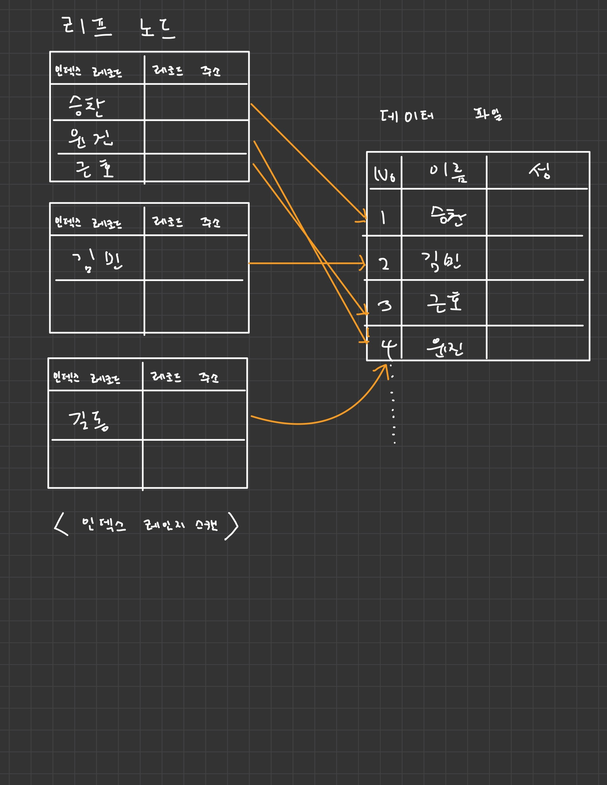

# 10.실행 계획

---

<br>

## 10.3 실행 계획 분석

---
> 실행 계획에서는 실행 계획이 어떤 접근 방법을 사용해서 어떤 최적화를 수행하는지, 그리고 어떤 인덱슬르 사용하는지 등을 이해하는 것이 중요하다.

+ 실행 계획은 위에서 아래로 순서대로 표시된다.
+ 실행 계획 위쪽에 출력된 결과일수록 쿼리의 바깥 (Outer) 부분이거나 먼저 접근한 테이블이고, 아래쪽일수록 쿼리의 안쪽(Inner) 부분 또는 나중에 접근한 테이블이다.

<br>


### id 칼럼
행이 어떤 SELECT 구문을 나타내는 지를 알려주는 것으로 구문에 서브 쿼리나 UNION이 없다면 SELECT는 하나밖에 없기 때문에 모든 행에 대해 1이란 값이 부여되지만 이외의 경우에는 원 구문에서 순서에 따라 각 SELECT 구문들에 순차적으로 번호가 부여된다.

+ 테이블 접근 순서를 의미하지는 않는다. (접근 순서가 혼란스럽다면 EXPLAIN FORMAT = TREE 명령으로 확인)

### select_type 칼럼

> 각 단위 SELECT 쿼리가 어떤 타입의 쿼리인지 표시되는 칼럼

|구분|설명|
|:---:|---|
|SIMPLE | UNION 이나 서브쿼리를 사용하지 않는 단순한 SELECT 
|PRIMARY | UNION이나 서브쿼리를 가지는 SELECT 쿼리의 실행 계획에서 가장 바깥쪽에 있는 단위 쿼리
|UNION | UNION(집합을 결합하는) 쿼리에서 PRIMARY 와, DERIVED 제외한 나머지 SELECT
|DEPENDENT_UNION | UNION 과 동일하나, 내부 쿼리가 외부 쿼리의 값을 참조해서 처리할 때 나타나는 키워드 
|UNION_RESULT | UNION 쿼리의 임시 결과물을 담아두는 테이블이며 id 값은 부여되지 않는다.
|SUBQUERY | FROM 절 이외에서 사용되는 그 밖의 모든 서브쿼리
|DEPENDENT SUBQUERY | 서브쿼리가 바깥쪽 SELECT 쿼리에서 정의된 커럶을 사용하는 경우
|<u><b>DERIVED</b></u> | (mysql 5.5)FROM 절에 사용되는 서브쿼리, (mysql 5.6) 단위 SELECT 쿼리의 실행 결과로 메모리나 디스크에 임시 테이블을 생성하는 경우
|DEPENDENT DERIVED | 테이블이 래터럴 조인으로 사용된 것을 의미
|UNCACHEABLE SUBQUERY | 서브쿼리와 동일하지만 공급되는 데이이터 값에 대해 서브쿼리를 재처리. 외부 쿼리에서 공급되는 데이터 값이 동일하더라도 캐시된 결과를 사용할 수 없는 경우
|UNCACHEABLE UNION | UNION 과 동일하지만 공급되는 데이이터 값에 대하여 UNION 쿼리를 재처리

#### DERIVED 키워드

> 쿼리를 튜닝하기 위해 실행 계획을 확일할 때 가장 먼저 select_type 이 DERIVED인 것인지 확인하고 join으로 바꿔주는 것이 좋다. 

#### 서브쿼리
+ 중첩된 쿼리(Nested Query) : SELECT 되는 칼럼에 사용된 서브쿼리
+ 서브쿼리(Subquery) : WHERE 절에 사용된 경우
+ 파생 테이블(Derived Table) : FROM 절에 사용된 서브쿼리를 MySQL 에서는 파생테이블이라 하며, 일반적으로 인라인 뷰 또는 서브 셀렉트라 한다.

+ 서브쿼리가 반환하는 값의 특성에 따라 구분되기도 하는데..
    + 스칼라 서브쿼리(Scalar Subquery) : 하나의 값만 반환하는 쿼리
    + 로우 서브쿼리(Row Subquery) : 칼럼의 개수와 관계없이 하나의 레코드만 반환하는 쿼리

### table 칼럼

|구분|설명|
|:---:|---|
| NULL | FROM DUAL 같은 문장을 쓰는 경우
| <derived N>, <union M,N> |  "<>" 둘러싸인 이름은 임시 테이블을 의미

### partitions 칼럼
> 파티션에 대한 실행계획을 표시해준다. 파티션을 지정한 테이블의 경우 type이 ALL로 표시되는데 이는 풀테이블 스캔이 아닌 파티션에 대한 풀스캔을 의미한다. 

### <U><b>type</b></U> 칼럼
> 쿼리의 실행 계획에서 type 이후의 칼럼은 MySQL 서버가 각 테이블의 레코드를 어떤 방식으로 읽었는지를 나타낸다.
>
> 일반적으로 쿼리를 튜닝할 때 인덱스를 효율적으로 사용하는지 확인하는 것이 중요하므로 type 칼럼은 반드시 체크해야 할 중요한 정보다.

+ all 키워드를 제외한 나머지는 모두 인덱스를 사용하는 접근 방법이다.
+ 아래는 성능 순서대로 정리한 키워드다.

|구분|설명|
|:---:|---|
|system | 단 1건만 존재하는 테이블 또는 한 건도 존재하지 않는 테이블 참조 (innodb 에서는 나타나지 않는다.) 
|const | 테이블의 레코드 건수와 관계없이 쿼리가 프라이머리 키나 유니크 키 칼럼을 이용하는 WHERE 조건절을 가지며, 반드시 1건을 반환하는 쿼리의 처리 방식
|eq_ref | 여러 테이블이 조인되는 쿼리의 실행 계획에서만 표시된다. 조인에서 처음 읽은 테이블의 칼럼 값을, 그다음 읽어야 할 테이블의 프라이머리 키나 유니크 키 칼럼의 검색 조건에 사용할때를 가르킨다.
|ref | eq_ref 와는 달리 조인의 순서와 관계없이 사용되며, 프라이머리 키나 유니크 키 등의 제약 조건도 없다. 인덱스의 종류와 관계 없이 동등(eq) 조건으로 검색할 때는 ref 접근 방법이 사용된다.
|fulltext| 전문 검색 인덱스를 사용해 레코드를 읽는 접근 방법
|ref_or_null | ref 와 같지만 null 이 추가되어 검색되는 경우
|unique_subquery | WHERE 조건절에서 사용될 수 있는 IN 형태의 서브쿼리를 위한 접근 방법이며 서브쿼리 결과가 중복이 없는 유니크한 값만 반환하는 경우 ex) select * from where no IN (select..)
|index_subquery | IN 형태의 서브쿼리 결과가 중복된 값을 가진 경우지만 인덱스를 통해 중복된 값을 제거할 수 있다. 
|range | 특정 범위 내(IS NULL, BETWEEN, IN, LIKE)에서 인덱스를 사용하여 원하는 데이터를 추출하는 경우, 레코드 수에 따라 좋고 나쁨이 갈린다.
|index_merge | 2개 이상의 인덱스를 이용해 각각의 검색 결과(OR 조건)를 만든 후, 그 결과를 병합하여 처리하는 방식 
|index | 인덱스를 처음부터 끝까지 찾아서 검색하는 방식이며 인덱스 풀스캔을 뜻한다. (LIMIT 조건과 함께 있다면 성능상 나쁘지 않다.)
|ALL | 테이블 풀스캔

#### <u><b>const, eq_req, ref 비교</b></u>
> const : 조인의 순서와 관계 없이 프라이머리 키나 유니크 키의 모든 칼럼에 대해 동등 조건으로 검색(반드시 1건의 레코드만 반환)
> 
> eq_req : 조인에서 첫 번째 읽은 테이블의 칼럼값을 이용해 두 번째 테이블을 프라이머리 키나 유니크 키로 동등 조건 검색
> 
> ref : 조인의 순서와 인덱스 종류에 관계없이 동등 조건으로 검색(1건의 레코드만 반환한다는 보장이 없어도 됨)

+ 이 세가지 접근 방법 모두 WHERE 절에 사용하는 비교 연산자는 동등 비교 연산자여야 한다는 공통점이 있다. ("=", "<=> : null에 대한 비교 방식만 조금 다르고 = 와 같은 연산")
+  세가지 모두 좋은 접근 방법으로 인덱스 분포다가 나쁘지 않다면 성능상ㅇ 문제를 일으키지 않는 접근 방법이다.

### possible_keys 칼럼
> 말 그대로 옵티마이저가 사용될 법 했던 인덱스 목록을 나타낸다. (후보)

### key 칼럼
> key 칼럼에 표시되는 인덱스는 최종 선택된 실행 계획에서 사용하는 인덱스이며, key 칼럼에 표시되는 값이 원하는 값인지가 중요하다.

### key_len 칼럼
> 쿼리를 처리하기 위해 다중 칼럼으로 구성된 인덱스에서 몇 개의 칼럼까지 사용했는지 나타낸다. 더 정확하게는 인덱스의 각 레코드에서 몇 바이트까지 사용했는지 알려준다.

### ref 칼럼
> 참조 조건으로 어떤 값이 제공됐는지 보여준다.

+ 참조 조건으로 상숫값을 지정했다면 ref 칼럼의 값은 const 로 표시되고, 다른 테이블의 칼럼값이면 테이블명과 칼럼명이 표시된다.

### rows 칼럼
> 실행 계획의 효율성 판단을 위해 예측했던 레코드 건수를 보여준다. (인덱스를 사용하는 조건에만..)

### filtered 칼럼
> 필터링되고 남은 레코드의 비율을 의미한다.

### extra 칼럼
> 쿼리의 실행 계획에서 성능에 관련된 중요한 내용인 고정된 몇 개의 문장이 표시되는데, 일반적으로 2~3개씩 함께 표시된다.
> 이 내용은 주로 내부적인 처리 알고리즘에 대해 조금 더 깊이 있는 내용을 보여주는 경우가 많다. 이 떄문에 버전이 바뀌며 최적화 기능이 도입될수록 새로운 내용이 더 추가될 수 있다. 

|구분|설명|
|:---:|---|
| const row not found |  쿼리의 실행 계획에서는 const 접근 방법(pk, uk를 조건문으로 가진 1건 이상 반환하는 쿼리)으로 테이블을 읽었지만 실제로는 해당 테이블에 레코드가 1건도 존재하지 않으면 이 내용이 표시된다. 
| deleting all rows | MyISAM 스토리지 엔진과 같이 스토리지 엔진의 핸들러 차원에서 테이블의 모든 레코드를 삭제하는 기능의 경우에 표시된다.
| Distinct | (1) Distinct |
| FirstMatch | 세미 조인의 여러 최적화 중에서 FirstMatch 전략이 사용됐을 경우 표사된다. 이 메시지에 함께 표시되는 테이블명은 기준 테이블을 의미한다.
| Full scan on NULL key | 칼럼1 IN (SELECT 칼럼2 FROM ..) 조건에서 칼럼1의 값이 NULL 일 경우 표시된다. 칼럼 1이 NULL이라면 서브쿼리에서 사용된 테이블에 풀스캔이 일어나기에 NULL 에 대한 비교가 필요없다면 칼럼1에 NOT NULL 조건을 붙이거나 조건절에 칼럼1 IS NOT NULL 조건을 붙여 옵티마이저에게 알려준다. 이 경우 같은 메시지가 표시되더라도 무시해도 된다.
| Impossible HAVING | HAVING 절에 칼럼1 IS NULL 조건이 추가됐지만 칼럼1의 정의에 NULL 이 발생할 수 없을때 표시 된다. 쿼리를 잘못 작성했을 경우에 볼 수 있다.
| Impossible WHERE | Impossible HAVING 과 비슷하며 WHERE 조건이 항상 FALSE 가 될 수밖에 없는 경우 표시된다.
| LooseScan | 세미 조인 최적화 중에서 LooseScan 최적화 전략이 사용된 경우 표시된다. 
| No matching min/max row | Impossible HAVING, Impossible WHERE 과 비슷하게 잘못된 쿼리에서 나타나며 MAX, MIN 의 값이 NULL 을 반환하는 경우 표시된다.
| no matching row in const table | Impossible HAVING, Impossible WHERE 과 비슷하게 잘못된 쿼리에서 나타나며 const 방법으로 접근할 때 일치하는 레코드가 없다면 실행 계획에 대한 기초자료가 없을을 의미하기 위해 표시된다.
| no matching rows after partition pruning | 파티션된 테이블에 대한 UPDATE, DELETE 명령의 실행 계획에서 표시될 수 있는데, 해당 파티션에 대상 레코드가 없을 때 표시된다. 단순히 삭제한 레코드가 없음을 의미하는 것이 아니라 대상 파티션이 없음을 의미한다.
| No tables used | FROM 절이 없거나 DUAL (칼럼과 레코드를 각각 1개씩만 가지는 가상의 상수 테이블)을 사용한 경우 표시된다.
| Not exist | A 테이블에는 존재하지만 B 테이블에는 존재하지 않는 값을 조회할 떄 not exist(), not in() 같은 안티 조인을 사용하는데, 같은 처리를 left outer join을 사용할 수 있고 아우터 조인을 이용해 안티 조인을 수행하는 쿼리에서 메시지가 표시된다. 
| Plan isn`t ready yet | mysql 8 버전에서 다른 커넥션이 해당 테이블을 읽고 있는데 EXPLAIN FOR CONNECTION 명령을 실행했을 때 해당 메시지를 확인할 수 있다. 이 경우는 해당 커넥션에서 아직 쿼리의 실행 계획을 수립하지 못한 상태에서 EXPLAIN FOR CONNECTION 명령이 실행 됐음을 의미한다.
| Range checked for each record(index map : N) | (2) Range checked for each record(index map : N) | 
| Recursive | (3) Recursive
| Rematerialize | MySQL 8 버전부터 래터럴 조인 기능이 추가됐는데, 이 경우 래터널 조인되는 테이블은 선행 테이블의 레코드별로 서브쿼리를 실행해서 결과를 임시테이블에 저장한다. 이 과정을 "Rematerializing" 이라 하며, 임시 테이블을 생성하는 경우 해당 구문을 볼 수 있다.
| Select tables optimized away | MIN(), MAX() 만 SELECT 절에 사용되거나 GROUP BY 로 MIN(), MAX()를 조회하는 쿼리에서 인덱스를 오름차순 또는 내림차순으로 1건만 읽는 형태의 최적화가 적용된다면 해당 구문을 볼 수 있다. MyISAM 같은 경우 GROUP BY 없이 COUNT(*) 할 떄도 나타나며 WHERE 절을 사용하면 볼 수 없다.
| Start temporary, End temporary | 세미 조인 최적화 중에서 (4) Duplicated Weed-out 전략이 사용되면 해당 키워드를 볼 수 있다. Duplicated Weed-out 전략은 불필요한 중복 건을 제거하기 위해서 내부 임시 테이블을 사용하는데, 이때 조인되어 내부 임시 테이블에 저장되는 테이블을 식별하기 위해 조인의 첫 번째 테이블에 start temporary 를 보여주고 조인이 끝나는 부분에 end temporary 를 표시한다.  
| unique row not found | 두 개의 테이블이 각각 유니크 칼럼으로 아우터 조인을 수행하는 쿼리에서 아우터 테이블에 일치하는 레코드가 없을 때 표시된다. 
| Using filesort | (5) Using filesort 
| Using index | (6) Using index
| Using index condition | 옵티마이저가 인덱스 컨디션 푸시 다운 최적화를 사용하면 표시된다.
| Using index for group-by | group by 처리에 인덱스를 이용하면 표시된다. (7) Using index for group-by
| Using index for skip scan | 옵티마이저가 스킵 스캔 최적화를 사용하면 다음 키워드가 표시된다. MySQL 8.0 부터는 루스 인덱스 스캔 최적화를 확장한 (8) 인덱스 스킵 스캔 최적화가 도입됐다.
| Using join buffer (Block Nested Loop, Batched Key Access, hash join) | (9)
| Using MPR(multi range read) | MySQL 엔진은 실행 계획을 수립하고 그에 맞는 API 를 스토리지 엔진에서 호출해서 처리한다. 그러나 스토리 엔진 레벨에서는 쿼리 실행의 전체적인 부분을 알지 못하기 때문에 최적화에 한계가 있다. 이러한 단점을 보완하기 위해 MPR 최적화가 도입됐다. MySQL 엔진은 여러 개의 키 값을 한 번에 스토리지 엔진으로 전달하고, 스토리 엔진은 넘겨받은 키 값들을 정렬해서 최소한의 페이지 접근만으로 필요한 레코드를 읽을 수 있게 최적화 한다.
| (10) Using sort_union, Using union, Using intersect | 쿼리가 index_merge 접근 방법으로 실행되는 경우에는 2개 이상의 인덱스가 동시에 사용될 수 있다. 이때 실행 계획의 Extra 칼럼에는 두 인덱스로부터 읽은 결과를 어떻게 병합했는지 더 상세하게 설명하기 위해 3개 중 하나의 메시지를 출력한다.
| Using Temporary | 서버에서 쿼리를 처리하는 동안 중간 결과를 담아 두기 위해 임시 테이블을 사용한다. 임시 테이블은 메모리상에 생성될 수도 있고, 디스크상에 생성될 수도 있다. 임시 테이블을 사용했다면 해당 키워드를 볼 수 있고 어디에 생성됐는지는 알 수 없다. (확인은 서버 상태 변수값으로 확인)
| Using Where | MySQL 엔진 레이어에서 별도의 가공을 해서 <U>필터링</U> 작업을 처리한 경우에만 표시된다. 실행 계획에서 가장 흔히 표시되는 내용이기도 하다.
| Zero limit | 때로는 MySQL 서버에서 데이터 값이 아닌 쿼리 결괏값의 메타데이터만 필요한 경우도 있는데 쿼리의 결과가 몇 개의 칼람을 가지고, 각 칼럼의 타입은 무엇인지 등의 정보만 필요한 경우가 있다. 이런 경우에는 쿼리의 마지막에 LIMIT 0을 사용하면 되는데, 이때 옵티마이저는 사용자의 의도를 알아채고 해당 메시지를 표시해준다.

---


#### (1) Distinct

```SQL
EXPLAIN 
SELECT DISTINCT d.dept_no
FROM departments d, dept_emp de WHERE de.dept_no = d.dept_no;

| id | select_type | table | type |     key    | Extra 
| 1  | SIMPLE      |   d   | index| ux_deptname| Using index; Using temporary
| 1  | SIMPLE      |   de  | ref  | primary    | Using index; Distinct

```
실제 조회하려는 값은 dept_no 인데 dept_emp(de) 테이블과 departments(d) 테이블에 모두 존재하는 dept_no만 중복없이 유니크하게 가져오는 쿼리이다.
쿼리의 Distinct 처리를 위해 조인하지 않아도 되는 항목은 모두 무시하고 꼭 필요한 것만 조인했으며, dept_emp(de) 테이블에서는 꼭 필요한 레코드만 읽었다.

d 테이블의 레코드&nbsp;&nbsp;&nbsp;&nbsp;&nbsp;&nbsp;&nbsp;&nbsp;&nbsp;&nbsp;&nbsp;&nbsp;&nbsp;&nbsp;&nbsp;de 테이블의 레코드  <br/>
dept_no : 1      ---------------->   dept_no : 1 = 읽음 <br/>
&nbsp;&nbsp;&nbsp;&nbsp;&nbsp;&nbsp;&nbsp;&nbsp;&nbsp;&nbsp;&nbsp;&nbsp;&nbsp;&nbsp;&nbsp;&nbsp;&nbsp;&nbsp;&nbsp;---------------->   ~~dept_no : 1 = 무시~~ <br/>
dept_no : 2      ---------------->   dept_no : 2 = 읽음 <br/>
dept_no : 3      ---------------->   dept_no : 3 = 읽음 <br/>
&nbsp;&nbsp;&nbsp;&nbsp;&nbsp;&nbsp;&nbsp;&nbsp;&nbsp;&nbsp;&nbsp;&nbsp;&nbsp;&nbsp;&nbsp;&nbsp;&nbsp;&nbsp;&nbsp;---------------->   ~~dept_no : 3 = 무시~~ <br/>

---

#### (2) Range checked for each record(index map : N)

조인 조건에 상수가 없고 둘 다 변수일때 옵티마이저는 풀스캔과 인덱스 레인지 스캔 중에서 어느 것이 효율적인지 판단할 수 없다.

```SQL
EXPLAIN 
SELECT *
FROM table1 t1, table2 t2
WHERE t1.pk >= t2.pk -- 변수 사용
-- 상수 사용의 예 t1.pk = 1000000
```

위의 쿼리에서 최적의 조인 방식은 t1 테이블의 pk가 작을 땐 t2 테이블을 풀스캔하고, t1 테이블의 pk가 큰 값일 떈 t2 테으블을 인덱스 레인지 스캔하는 방법인데 이와 같은 상황을
`레코드 마다 인덱스 레인지 스캔을 체크한다` 라고 말할 수 있는데 이 같은 상황에서 Extra 칼럼에 Range checked for each record(index map : N) 메시지를 볼 수 있다.

* 실행 계획 시나리오는 P.468 참고

---

#### (3) Recursive

MySQL 8 버전부터는 CTE(Command Table Expression)을 이용해 재귀 쿼리를 작성할 수 있게 됐다.

```SQL
WITH RECURSIVE cte (n) AS 
    ( 
        SELECT 1
        UNION ALL 
        SELECT n + 1 FROM cte WHERE n < 5
    )
    SELECT * FROM cte;
```

WITH 쿼리 실행 작업
  1. "n" 이라는 칼럼 하나를 가진 cte 라는 이름의 내부 임시 테이블 생성
  2. "n" 칼럼의 값이 1 부터 5까지 1씩 증가하게 해서 레코드 5건을 만들어서 cte 내부 임시 테이블에 저장

그리고 WITH 절 다음의 SELECT 쿼리에서 WITH 절에서 생성된 임시 테이블을 풀 스캔해서 결과를 반환한다. 이렇게 CTE를 이용한 재귀 쿼리의 실행 계획은 Extra 칼럼에 Recursive 구문이 표시된다.

---


#### (4) Duplicated Weed-out

세미 조인 서브쿼리를 일반적인 Inner Join 으로 바꿔서 실행하고 마지막에 중복된 레코드를 제거하는 방법으로 처리되는 최적화 알고리즘

```SQL
EXPLAIN 
SELECT * FROM employees e 
WHERE e.emp_no = IN (SELECT  s.emp_no FROM salaries s WHERE s.salary > 150000);
```

salaries PK는 emp_no, from_date 이므로 조건절을 조회하면 그 결과에 중복된 emp_no가 발생할 수 있다.

옵티마이저는 위와 같은 원본 쿼리를 최적화 알고리즘을 통해 아래처럼 실행한다.

```SQL
SELECT * FROM employees e, salaries s
WHERE e.emp_no = s.emp_no AND s.salary > 150000
GROUP BY e.emp_no;
```

---

#### (5) Using filesort

> ORDER BY 를 처리하기 위해 인덱스를 이용할 수도 있지만 적절한 인덱스를 사용하지 못할 때는 MySQL 서버가 조회된 레코드를 다시 한번 정렬해야 한다.

ORDER BY 처리가 인덱스를 사용하지 못한다면 해당 키워드가 표시된다. 이는 조회된 레코드를 정렬용 메모리 버퍼에 복사해 퀵 소트 또는 힙 소트 알고리즘을 이용해 정렬을 수행하게 된다는 의미이며 ORDER BY 가 사용된 쿼리에서만 볼 수 있다.

<strong>
실행 계획의 Extra 칼럼에 Using filesort 가 나타나면 많은 부ㅏ를 일이키므로 가능하다면 쿼리를 튜닝하거나 인덱스를 생성하는 것이 좋다. (중요하므로 11.4.9에 다시 다룸)
</strong>

---

#### (6) Using index

> 테이터 파일을 전혀 읽지 않고 인덱스만 읽어서 쿼리를 모두 처리할 수 있을때 표시돤다.

인덱스를 이용해 처리하는 쿼리에서 가장 큰 부하를 차지하는 부분은 인덱스 검색에서 일치하는 키 값들의 레코드를 읽기 위해 데이터 파일을 검색하는 작업이다. <br/>

최악의 경우에는 인덱스를 통해 검색된 결과 레코드 한 건 한 건마다 디스크를 한 번씩 읽어야 할 수도 있다. <br/>



이미지와 같이 employees 테이블에 데이터가 저장돼 있고 다음의 쿼리가 인덱스 레인지 스캔 접근 방법을 사용한다고 해보자.

```SQL
EXPLAIN 
SELECT 이름, 생일 
FROM employees
WHERE 이름 BETWEEN '승찬' AND '근호';

데이터는 약 5만건
```

실제 실행 계획은 풀 테이블 스캔을 사용할 것이지만, 여기서는 employees 테이블의 이름 칼럼에 생성된 인덱스 ix_이름 을 사용한다면 어떤 비효율이 발생하는지 알아보기 위해서 
인덱스 레인지 스캔으로 처리될 때 필요한 작업들을 살펴보자.

이 쿼리가 인덱스를 사용한다면 employees 테이블의 이름 칼럼에 생성된 인덱스를 이용해 일치하는 레코드 5만여 건을 검색하고, 각 레코드의 생일 칼럼의 값을 읽기 위해
각 레코드가 저장된 데이터 페이지를 5만여 번 읽어야 한다.

실행 계획을 살펴보면 옵티마이저는 인덱스를 사용하는 것 보다 풀 테이블 스캔으로 처리하는 편이 더 효율적이라고 판단했을 것이다.

```SQL
| id |select_type|   table   | type |  key    | Extra
| 1  | SIMPLE    |employees  | all  | null    | Using where
```

이제 쿼리에서 생일 칼럼은 뺴고 이름만 검색한다면 풀 테이블 스캔이 아닌 인덱스 레인지 스캔으로 처리된다는 것을 알 수 있다.

```SQL
EXPLAIN 
SELECT 이름
FROM employees
WHERE 이름 BETWEEN '승찬' AND '근호';

| id |select_type|   table   | type   |  key      | Extra
| 1  | SIMPLE    |employees  | range  |  ix_이름   | Using where; Using index
```

위와 같이 데이터 파일을 읽어 올 필요가 없이 인덱스를 통해 처리할 수 있는 쿼리에 'Using index' 를 표시해준다.
이렇게 인덱스만으로 처리되는 것을 커버링 인덱스라고도 부른다.

인덱스 레인지 스캔을 사용하지만 쿼리의 성능이 만족스럽지 못한 경우라면 인덱스에 있는 칼럼만 사용하도록 변경해 큰 성능 향상을 볼 수 있다.

또한 사진에서 레코드 주소에는 pk(No)가 저장된 것으로 볼 수 있는데 이는 곧 이름 칼럼에 인덱스만 만들어도 그 인덱스에 pk 칼럼이 같이 저장되는 효과를 낸다. 이러한 클러스터링 인덱스 특성 때문에 
쿼리가 '커버링 인덱스' 로 처리될 가능성이 상당히 높다.

레코드 건수에 따라 차이가 있겠지만 쿼리를 커버링 인덱스로 처리할 수 있을때와 아닐 때 성능 차이는 수십 배에서 수백 배까지 날 수 있다. 

실행 계획의 type 칼럼 (접근 방법) 이 eq_ref, ref, range, index_merge, index 등과 같이 인덱스를 사용하는 실행 계획에서는 모두 Extra 칼럼에 'Using Index' 가 표시될 수 있다.
즉, 인덱스 레인지 스캔(eq_ref, ref, range, index_merge 등의 접근 방법) 을 사용할 때만 커버링 인덱스로 처리되는 것은 아니다.

인덱스 풀 스캔을 실행할 때도 커버링 인덱스로 처리될 수 있는데, 이때도 똑같은 인덱스 풀 스캔의 접근 방법(type = index) 이라면 커버링 인덱스가 아닌 경우보다 훨씬 빠르게 처리된다.

---

#### (7) Using index for group-by

1. 타이트 인덱스 스캔을 통한 group by 처리 
   - AVG(), SUM(), COUNT() 함수 처럼 조회하려는 값이 모든 인덱스를 다 읽어야 할 때는 필요한 레코드만 듬성 듬성 읽을 수 없다.
   이러한 쿼리를 단순히 group by 를 위해 인덱스를 사용하기는 하지만, 이를 루스 인덱스 스캔이라고 하지는 않는다. 또한 이런 쿼리에서는 해당 키워드가 나타나지 않는다.
   
```SQL
EXPLAIN 
SELECT 이름, COUNT(*) 
FROM employees 
GROUP BY 이름;

| id |select_type|   table   | type   |  key      | Extra
| 1  | SIMPLE    |employees  | index  |  ix_이름   | Using index
```

2. 루스 인덱스 스캔을 통한 group by 처리 
    - 단일 칼럼으로 구성된 인덱스에서는 그루핑 칼럼 말고는 아무것도 조회되지 않는 쿼리에서 루스 인덱스 스캔을 사용할 수 있다.
    - 다중 칼럼으로 만들어진 인덱스에서는 group by 절이 인덱스를 사용할 수 있어야 함은 물론이고 MIN(), MAX() 같이 조회하는 값이 인덱스의 첫 번째 또는 마지막 레코드믄 읽어도 되는 루스 인덱스 스캔이 사용될 수 있다.

```SQL
EXPLAIN 
SELECT emp_no, MIN(..), MAX(..)
FROM salaries
GROUP BY emp_no;   

| id |select_type|   table   | type   |  key       | Extra
| 1  | SIMPLE    | salaries  | range  |  primary   | Using index for group-by
```

group by 에서 인덱스를 사용하려면 우선 요건을 갖추는게 중요하며, 그 이전에 WHERE 절에서 사용하는 인덱스에 의해서도 group by 절에 인덱스 사용 여부가 영향을 받는다.

* WHERE 절이 없는 경우
    - GROUP BY 절의 칼럼과 SELECT 로 가져오는 칼럼이 루스 인덱스 스캔을 사용할 수 있는 조건만 갖추면 된다. 그렇지 못한 쿼리는 타이트 인덱스 스캔이나 별도의 정렬 과정을 통해 처리된다.

* WHERE 절이 있지만 검색을 위해서 인덱스를 사용 못하는 경우
    - 먼저 GROUP BY 절을 읽은 후, WHERE 조건의 비교를 위해 데이터를 읽어야 한다. 이 경우도 루스 인덱스 스캔을 이용할 수 없으며, 타이트 인덱스 스캔 과정을 통해 GROUP BY 처리된다.
    
* WHERE 절이 있지만 검색을 위해 인덱스를 사용하는 경우
    - 하나의 단위 쿼리가 실행되는 경우에 index_merge 이외의 접근 방법에서는 단 하나의 인덱스만 사용할 수 있다. 그래서 WHERE 절의 조건이 인덱스를 사용할 수 있으면 GROUP BY 가 인덱스를 사용할 수 있는 조건이 까다로워 진다.
    - 옵티마이저는 WHERE 절과 GROUP BY 절에 각각 다른 인덱스가 사용된 경우 WHERE 절의 인덱슬를 사용할 수 있게 실행 계획이 수립된다.
    - WHERE 절과 GROUP BY 절에 같은 인덱스가 사용된 경우 루스 인덱스 스캔을 사용할 수 있다.
    
----

#### (8) 인덱스 스킵 스캔
데이터베이스에서 인덱스의 핵심은 값이 정렬돼 있다는 것이며, 이로 인해 인덱스를 구성하는 칼럼의 순서가 매우 중요하다. 

```SQL
ALTER TABLE test
ADD INDEX ix_test (성별, 생일);

-- 인덱스를 사용하지 못하는 쿼리
SELECT * FROM test WHERE 생일 >= '1965-05-22';

-- 인덱스를 사용하는 쿼리
SELECT * FROM test WHERE 성별='남자' AND 생일 >= '1965-05-22';
```
이러한 문제점을 해결하기 위해서는 생일부터 시작하는 인덱스를 다시 만들어야 했지만 MySQL 8.0에서는 인덱스 스킵 스캔을 통해 해결하였다.

---

#### (10) Using sort_union, Using union, Using intersect

Using sort_union
- 각각의 인덱스를 사용할 수 있는 조건이 AND로 연결된 경우 각 처리 결과에서 교집합을 추출해내는 작업을 수행했다는 의미

Using union
- 각 인덱스를 사용할 수 있는 조건이 OR로 연결된 경우 각 처리 결과에서 합집합을 추출해내는 작업

Using intersect
- Using union 과 같은 작업을 수행하지만 Using union 으로 처리될 수 없는 경우(OR로 연결된 상대적으로 대량의 range 조건들) 이 방식으로 처리된다.
- Using sort_union 과 Using union 의 차이점은 sort_union 은 프라이머리 키만 먼저 읽어서 정렬하고 병합한 이후 비로소 읽어서 반환할 수 있다는 것이다.

----