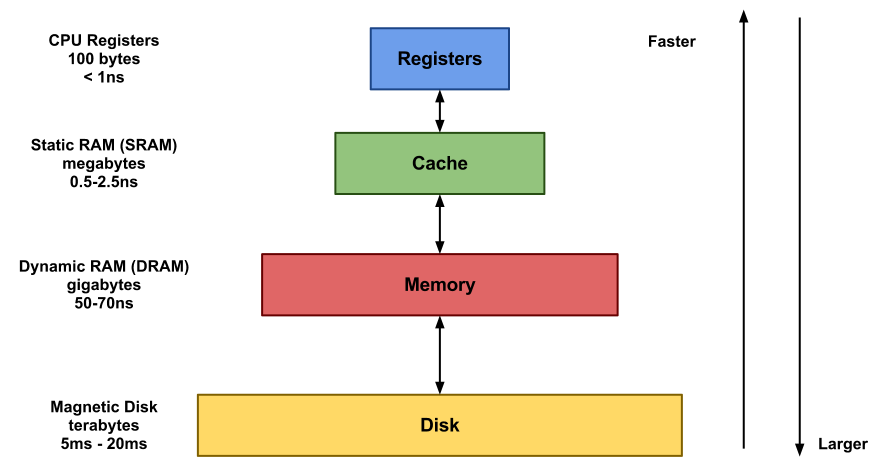

# 8.인덱스

> 인덱스에 대한 기본 지식은 지금도 앞으로도 개발자나 관리자에게 매우 중요한 부분이며, 쿼리 튜닝의 기본이 될 것이다. 

---

## 8.1 디스크 읽기 방식

---

> 데이터베이스의 성능 튜닝은 어떻게 디스크 I/O를 줄이느냐가 관건일 때가 상당히 많다.

+ 디스크 읽기 방식
  - [ ] 랜덤 I/O
  - [ ] 순차 I/O

### 8.1.1 하드 디스크 드라이브(HDD)와 솔리드 스테이트 드라이브(SSD)

---

> 컴퓨터에서 CPU 나 메모리 같은 주요 장치는 대부분 전자식 장치지만 하드 디스크 드라이브는 기계식 장치이다. <Strong> 그래서 데이터베이스 서버에서는 항상 디스크 장치가 병목이 된다.</Strong>

  

- [ ] 하드 디스크
  + 기계식 저장 매체(장치)이다.
  

- [ ] SSD (Solid State Drive)
  + 전자식 저장 매체이다. 
  + 하드 디스크 드라이브와 같은 인터페이스를 지원하므로 내장 디스크나 DAS 또는 SAN 에서도 그대로 사용할 수 있다.
  + 하드 디스크 드라이브에서 데이터 저장용 플래터를 제거하고 그 대신 플래시 메모리를 장착하였다.
    + 디스크 원판을 기계적으로 회전시킬 필요가 없으므로 빠른 데이터 읽기, 쓰기가 가능해졌다.
  + 플래시 메모리는 전원이 공급되지 않아도 데이터가 삭제되지 않는다.
  + 컴퓨터 메모리(D-Ram) 보다는 느리지만 기계식 하드 디스크 드라이브보다는 훨씬 빠르다.

 

### 8.1.2 랜덤 I/O 와 순차 I/O

---

- [ ] 

 
