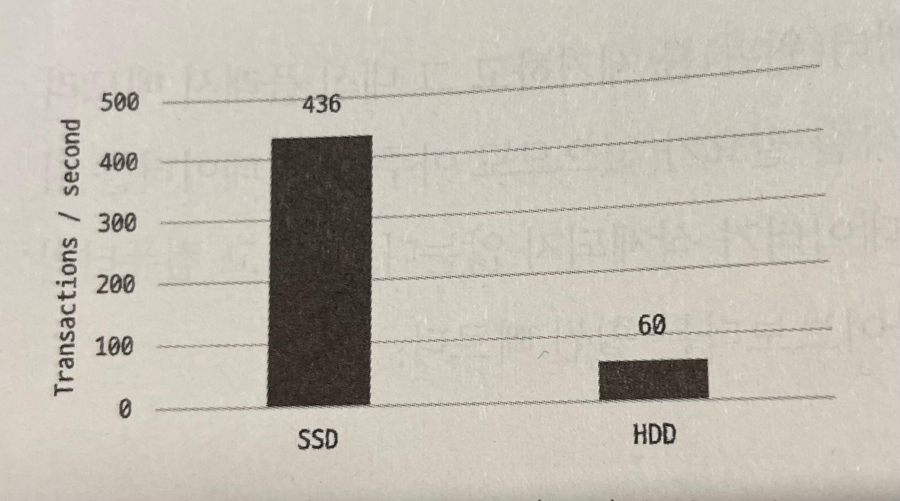

# 8.인덱스

> 인덱스에 대한 기본 지식은 지금도 앞으로도 개발자나 관리자에게 매우 중요한 부분이며, 쿼리 튜닝의 기본이 될 것이다. 

---

## 8.1 디스크 읽기 방식

---

> 데이터베이스의 성능 튜닝은 어떻게 디스크 I/O를 줄이느냐가 관건일 때가 상당히 많다.

+ 디스크 읽기 방식
  - [ ] 랜덤 I/O
  - [ ] 순차 I/O

### 8.1.1 하드 디스크 드라이브(HDD)와 솔리드 스테이트 드라이브(SSD)

---

> 컴퓨터에서 CPU 나 메모리 같은 주요 장치는 대부분 전자식 장치지만 하드 디스크 드라이브는 기계식 장치이다. <Strong> 그래서 데이터베이스 서버에서는 항상 디스크 장치가 병목이 된다.</Strong>

<small> * 병목(bottleneck) 현상은 전체 시스템의 성능이나 용량이 하나의 구성 요소로 인해 제한을 받는 현상을 말한다. </small>

 
  

- [ ] 하드 디스크
  + 기계식 저장 매체(장치)이다.
  

- [ ] SSD (Solid State Drive)
  + 전자식 저장 매체이다. 
  + 하드 디스크 드라이브와 같은 인터페이스를 지원하므로 내장 디스크나 DAS 또는 SAN 에서도 그대로 사용할 수 있다.
  + 하드 디스크 드라이브에서 데이터 저장용 플래터를 제거하고 그 대신 플래시 메모리를 장착하였다.
    + 디스크 원판을 기계적으로 회전시킬 필요가 없으므로 빠른 데이터 읽기, 쓰기가 가능해졌다.
  + 플래시 메모리는 전원이 공급되지 않아도 데이터가 삭제되지 않는다.
  + 컴퓨터 메모리(D-Ram) 보다는 느리지만 기계식 하드 디스크 드라이브보다는 훨씬 빠르다.
  
+ 순차 I/O 에서는 SSD 가 HDD 보다 조금 빠르거나 거의 비슷한 성능을 보이지만 랜덤 I/O 에서 훨씬 빠르다.
+ <Strong> 데이터베이스 서버에서 순차 I/O 의 작업은 그다지 비중이 크지 않고 랜덤 I/O 를 통해 작은 데이터를 읽고 쓰는 작업이 대부분이므로 SSD 의 장점은 DBMS 용 스토리지에 최적이라고 볼 수 있다.  </Strong>

 

### 8.1.2 랜덤 I/O 와 순차 I/O

---

> 랜덤 I/O 와 순차 I/O 의 의미는 HDD 의 플래터(원판)을 돌려서 읽어야 할 데이터가 저장된 위치로 디스크 헤더를 이동시킨 다음 데이터를 읽는 것을 의미한다.

#### 차이점

+ 디스크에 기록해야 할 위치를 찾기 위해 순차 I/O 는 디스크의 헤드를 1번 움직였고, 랜덤 I/O 는 3번 움직였다.
+ 디스크의 성능은 디스크에 데이터를 읽고 쓰는데 걸리는 시간 즉, 디스크 헤더를 움직여서 읽고 쓸 위치로 옮기는 단계에서 결정된다.
+ 그림에서는 순차 I/O 는 램덤 I/O 보다 거의 3배 정도 빠르다고 볼 수 있다.
+ 데이터베이스 대부분의 작업은 이러한 작은 데이터를 빈번히 읽고 쓰기 때문에 MySQL 서버에는 그룹 커밋이나 바이너리 로그 버퍼 또는 InnoDB 로그 버퍼 등의 기능이 내장돼 있다.
+ 일반적으로 쿼리를 튜닝하는 것은 랜덤 I/O 자체를 줄여주는 것이 목적이라고 할 수 있다.

#### 참고
+ 인덱스 레인지 스캔은 데이터를 읽기 위해 주로 랜덤 I/O 를 사용하며, 풀 테이블 스캔은 순차 I/O 를 사용한다.
