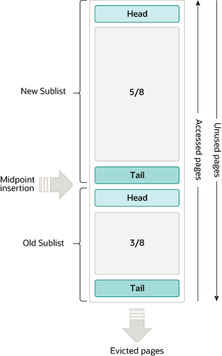
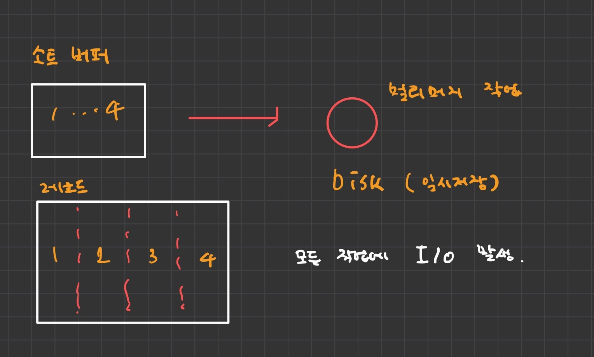
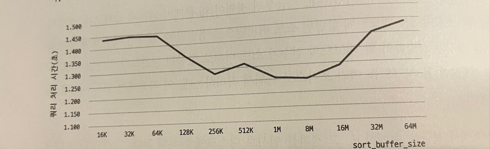
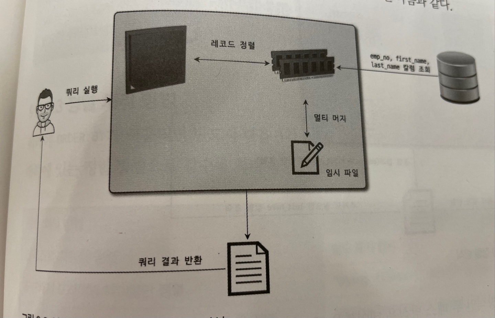
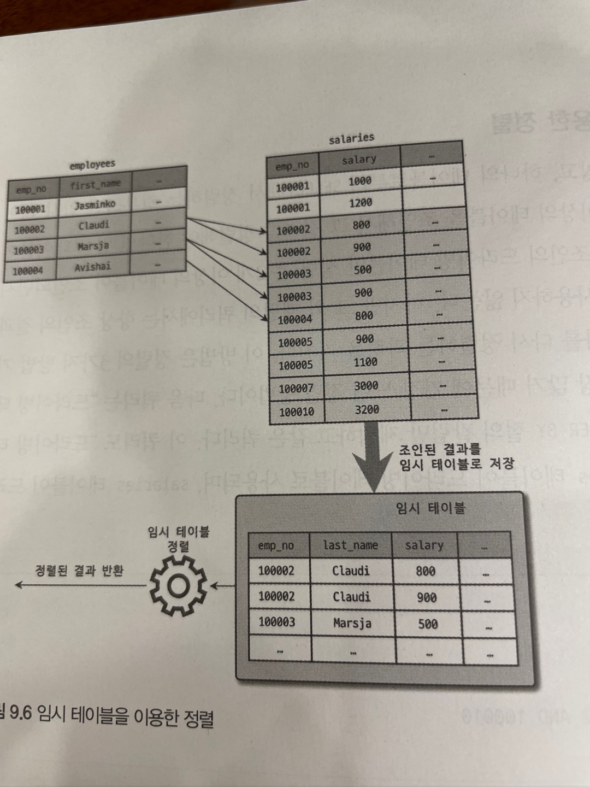

# 9.옵티마이저와 힌트

---

<br>

## 9.2 기본 데이터 처리

---

<br>

### 9.2.1 풀 테이블 스캔과 풀 인덱스 스캔

---

#### 옵티마이저가 풀 테이블 스캔을 선택하는 경우

1. 테이블의 레코드 건수가 너무 작은 경우 (일반적으로 테이블이 페이지 1개로 구성된 경우)
2. WHERE 절이나 ON 절에 인덱스를 이용할 수 있는 적절한 조건이 없는 경우
3. 인덱스 레인지 스캔을 사용할 수 있는 쿼리더라도 옵티마이저가 판단한 조건 일치 레코드 건수가 너무 많은 경우

<small> (P.232) 인덱스 레인지 스캔 내용 중 인덱스를 통해 읽어야 할 데이터 레코드가 20~25%를 넘으면 인덱스보다 테이블 데이터를 직접 읽는 것이 효율적인 처리 방식이다. </small>

<br>
<br>


#### MySQL 의 풀 테이블 스캔

> NyISAM 은 디스크로부터 페이지를 하나씩 읽어오지만 InnoDB 는 특정 테이블의 연속된 데이터 페이지가 읽히면 백그라운 스레드에 의해 리드 어헤드 작업이 시작된다. 

1. 풀 테이블 스캔이 실행되면 처음 몇 개의 데이터 페이지는 포그라운드 스레드가 페이지 읽기를 실행하지만 특정 시점부터는 읽기 작업을 백그라운드 스레드로 넘긴다.
2. 백그라운드 스레드가 읽기를 넘겨받는 시점부터는 한 번에 4개 또는 8개씩의 페이지를 읽으면서 계속 그 수를 증가 시킨다.
3. 한 번에 최대 64개의 데이터 페이지까지 읽어서 버퍼 풀에 저장한다.
4. 포그라운드 스레드는 버퍼 풀에 미리 준비된 데이터를 가져다 사용하기만 하면 되므로 쿼리가 빨리진다.
5. innodb_read_ahead_threshold 시스템 변수를 이용해 리드 어헤드 시작 임계값을 설정할 수 있다.

<br>

<small> 

리드 어헤드 (Read ahead) 란 ?

> 어떤 영역의 데이터가 앞으로 필요해지리라는 것을 예측해서 요청이 오기 전에 미리 디스크에 읽어 InnoDB 의 버퍼 풀에 가져다 두는 것을 의미한다. ( 케시 데이터 지역성 중 공간 지역성과 비슷해 보인다. )

버퍼 풀이란 ?

> 테이블(디스크의 데이터 파일) 및 인덱스 데이터를 캐시하는 주 메모리 영역을 버퍼 풀이라 한다. 버퍼 풀은 변경된 데이터를 모아서 처리하기 떄문에 랜덤 I/O 횟수를 줄일 수 있다.




MySQL 스레딩 구조 P.80

> MySQL 서버는 스레드 기반으로 작동하며 크게 포그라운드, 백그라운드 스레드로 구분된다.

포그라운드 스레드란 (Foreground thread)? P.82

> 포그라운드 스레드는 최소한 MySQL 서버에 접속된 클라이언트의 수만큼 존재하며, 주로 각 클라이언트 사용자가 요청하는 쿼리 문장을 처리한다.
> 
> 포그라운드 스레드는 데이터를 MySQL 의 데이터 버퍼나 캐시로부터 가져오며, 버퍼나 캐시에 없는 경우에는 직접 디스크의 데이터나 인덱스 파일로부터 데이터를 읽어와서 작업을 처리한다.


백그라운드 스레드란 (Background thread)? P.83
+ 인서트 버퍼를 병합하는 스레드
+ <b>로그를 디스크로 기록하는 스레드</b>
+ <b>InnoDB 버퍼 풀의 데이터를 디스크에 기록하는 스레드</b>
+ 데이터를 버퍼로 읽어오는 스레드
+ 잠금이나 데드락을 모니터링하는 스레드

</small>

#### MySQL 의 풀 인덱스 스캔
+ 리드 어헤드는 풀 테이블 스캔과 동일하게 사용된다.

```SQL  
1. 풀 인덱스 스캔을 하는 경우 : MySQL 서버는 단순히 레코드의 건수만 필요로 하는 쿼리라면 용량이 작은 인덱스를 선택하여 I/O 횟수를 줄일 확률이 크다.
SELECT COUNT(*) FROM employees; 


2. 풀 테이블 스캔을 하는 경우 : 레코드에만 있는 칼럼이 필요한 경우에는 풀 테이블 스캔을 한다.
SELECT * FROM employees; 
```

<br>

### 9.2.2 병렬 처리

---

> innodb_parallel_read_threads 시스템 변수를 이용해 하나의 쿼리에 최대 몇 개의 스레드를 이용해서 처리할지를 변경할 수 있다.

+ WHERE 조건 없이 단순히 테이블의 전체 건수를 가져오는 쿼리만 병렬처리 가능하다. (순차 I/O)
+ 스레드의 개수는 CPU 코어의 개수를 넘지 않도록 한다. 

```SQL
SET SESSION innodb_parallel_read_threads = 2;
SELECT COUNT(*) FROM tb;

SET SESSION innodb_parallel_read_threads = 4;
SELECT COUNT(*) FROM tb;

```

<br>

### 9.2.3 ORDER BY 처리 (using filesort)

---


#### 인덱스를 활용한 정렬

##### 장점
     INSERT, UPDATE, DELETE 쿼리가 실행될 때 이미 정렬된 인덱스를 순서대로 읽기만 하면 되므로 매우 빠르다.
##### 단점
     INSERT, UPDATE, DELETE 작업 시 부가적인 인덱스 추가/삭제 작업이 필요하다.
     인덱스 때문에 디스크 공간이 더 필요하다.
     인덱스의 개수가 늘어날수록 InnoDB 버퍼 풀을 위한 메모리가 더 필요하다.

<br> 

#### Filesort 를 이용한 정렬

##### 장점
     인덱스를 생성하지 않아도 되므로 인덱스를 활용한 정렬에 단점이 장점으로 바뀐다.
     정렬해야 할 레코드가 많지 않으면 메모리에서 Filesort 가 처리되므로 빠르다.
##### 단점
     정렬 작업이 쿼리 실행 시 처리되므로 레코드 대상 건수가 많아질수록 쿼리의 응답 속도가 느리다.

#### 사례
+ 정렬 기준이 너무 많아서 요건별로 모두 인덱스를 생성하는 것이 불가능한 경우
+ GROUP BY 의 결과 또는 DISTINCT 같은 처리의 결과를 정렬해야 하는 경우
+ UNION 의 결과와 같이 임시 테이블의 결과를 다시 정렬해야 하는 경우
+ 랜덤하게 결과 레코드를 가져와야 하는 경우

#### 적용확인
+ 실행 계획의 Extra 칼럼에 "Using filesort" 메세지가 표시되는지 여부
    
<br>

 
#### 2.2.3.1 소트 버퍼

---

> MySQL 은 정렬을 수행하기 위해 별도의 메모리 공간을 할당 받는데, 이 메모리 공간을 <b> 소트 버퍼(Sort Buffer)</b> 라 부른다.
>
> 소트 버퍼는 정렬이 필요한 경우에만 할당되며, 버퍼의 크기는 정렬해야 할 레코드의 크기에 따라 가변적으로 증가하고, 최대 사용 가능한 소트 버퍼 공간은 sort_buffer_size 를 통해 설정할 수 있다.


##### 레코드 건수가 소트 버퍼로 할당된 공간보다 큰 경우



+ 수행된 멀티 횟수는 Sort_merge_passes 상태변수에 누적해서 집계된다.
+ 소트 버퍼를 레코드 크기만큼 크게 설정 한다고 하여도 큰 차이가 없다.
+ 소프 버퍼의 크기가 256KB 에서 8MB 사이에서 최적의 성능을 보인다.
    
  
+ 정렬을 위해 할당하는 소트 버퍼는 세션 메모리 영역에 속한다. 즉, 여러 클라이언트가 공유해서 사용할 수 있는 영역이 아니다.
+ 소트 버퍼의 크기를 너무 크게 설정하면 (10MB 이상) 운영체재는 메모리 부족 현상을 겪을 수 있다.

<br>

#### 2.2.3.2 정렬 알고리즘

---

> 레코드를 정렬할 때 레코드 전체를 소트 버퍼에 담을지 또는 정렬 기준 컬럼만 소트 버퍼에 담을지에 따라 "싱글 패스" 와 "투 패스" 2가지 정렬 모드로 나눌 수 있다.

```SQL
-- 옵티마이저 트레이스 활성화
SET OPTIMIZER_TRACE = "enabled=on", END_MARKERS_IN_JSON = on;
SET OPTIMIZER_TRACE_MAX_MEM_SIZE = 1000000;

-- 쿼리 실행
SELECT * FROM employees ORDER BY last_name LIMIT 100000, 1;

-- 트레이스 내용 확인
SELECT * FROM INFORMATION_SCHEMA.OPTIMIZER_TRACE \G 
... 


'{
  "steps": [
    ....
    {
      "join_execution": {
        "select#": 1,
        "steps": [
          {
            "filesort_information": [
              {
                "direction": "asc",
                "table": "`hospital`",
                "field": "name"
              }
            ] /* filesort_information */,
            "filesort_priority_queue_optimization": {
              "limit": 100001,
              "rows_estimate": 1092,
              "row_size": 520,
              "memory_available": 262144
            } /* filesort_priority_queue_optimization */,
            "filesort_execution": [
            ] /* filesort_execution */,
            "filesort_summary": {
              "rows": 32,
              "examined_rows": 32,
              "number_of_tmp_files": 0,
              "sort_buffer_size": 261888,
              "sort_mode": "<sort_key, rowid>"
            } /* filesort_summary */
          }
        ] /* steps */
      } /* join_execution */
    }
  ] /* steps */
}'

// 출력 내용에서 filesort_summary 섹션의 sort_algorithm 필드에 정렬 알고리즘이 표시된다.

```
+ <sort_key, rowid> : 정렬 키와 레코드의 로우 아이디(Row ID)만 가져와서 정렬하는 방식
+ <sort_key, additional_fields> : 정렬 키와 레코드 전체를 가져와서 정렬하는 방식으로, 레코드의 칼럼들은 고정 사이즈로 메모리 저장
+ <sort_key, packed_additional_fields> : 정렬 키와 레코드 전체를 가져와서 정렬하는 방식으로, 레코드의 컬럼들은 가변 사이즈로 메모리 저장


##### 2.2.3.2.1 싱글 패스 정렬 방식

```SQL
SELECT emp_no, first_name, last_name FROM employees
ORDER BY first_name;
```



+ 정렬에 필요하지 않은 last_name 까지 전부 읽어서 소트 버퍼에 담고 정렬을 수행한다.
+ 투 패스 방식보다 더 많은 소트 버퍼 공간이 필요하다. 

##### 2.2.3.2.1 투 패스 정렬 방식

+ 정렬 대상과 프라이머리 키 값만 소트 버퍼에 담아서 정렬을 수행한다.
+ 정렬이 완료되면 테이블을 한 번 더 읽어서 last_name 을 가져온다.
+ 불합리가 발생한다. (테이블을 한 번 더 읽는 부분 - 더 많은 I/O 발생)

##### 싱글 패스 vs 투 패스

+ 레코드의 크기가 max_length_for_sort_date 변수에 설정된 값보다 클 때 투 패스 정렬 방식이 적용된다.
+ BLOB 이나 TEXT 타입의 컬럼이 SELECT 대상에 포함될 떄 투 패스 정렬 방식이 적용된다.
+ 정렬 대상 레코드의 크기나 건수가 작은 경우 싱글 패를, 큰 경우 투 패스 정렬이 효율적이다.

<br>

#### 2.2.3.3 정렬 처리 방법

--- 

> 옵티마이저는 효율적인 정렬 처리를 위해 인덱스를 이용할 수 있는지 검토하고 인덱스를 이용할 수 없다면 WHERE 조건에 일치하는 레코드를 검색해 정렬 버퍼에 저장하면서 정렬을 처리 (file sort) 할 것이다.
> 
> 이때 옵티마이저는 정렬 대상 레코드를 최소화하기 위해 2가지 방법 중 하나를 선택한다.
> + 조인의 드라이빙 테이블만 정렬한 다음 조인을 수행
> + 조인이 끝나고 일치하는 레코드를 모두 가져온 후 정렬을 수행

|정렬 처리 방법|실행 계획의 Extra 컬럼 내용|속도|
|:---:|:---:|:---:|
|인덱스를 사용한 정렬|별도 표기 없음|빠름|
|조인에서 드라이빙 테이블만 정렬|"Using filesort"|중간|
|조인에서 조인 결과를 임시 테이블로 저장 후 정렬|"Using temporary; Using filesort"|늦음|


##### 2.2.3.3.1 인덱스를 이용한 정렬

###### 인덱스 정렬을 사용하기 위한 조건

1. ORDER BY 에 명시된 컬럼이 제일 먼저 읽는 테이블 (조인이 사용된 경우 드라이빙 테이블) 에 속하고, ORDER BY 에 순서대로 생성된 인덱스가 있어야 한다.
   ```SQL
   SELECT * FROM employees e, salaries s
   WHERE e.emp_no = s.emp_no
   ORDER BY e.emp_no;
   
   인덱스가 정렬되어 있으므로 ORDER BY를 생략할 수 있지만, 성능상 차이가 없고 ORDER BY 를 명시하는 편이 추후 사이드 이펙트를 줄일 수 있다.
   ```
2. WHERE 절에 첫 번쨰로 읽는 테이블의 컬럼에 대한 조건이 있다면 그 조건과 ORDER BY 는 같은 인덱스를 사용할 수 있어야 한다.
3. B-Tree 게열의 졍렬된 인덱스이거나 여러 테이블이 조인되는 경우 네스티드-루프(Nested-loop) 방식의 조인이여야 한다.

<small>
Nested-loop 란?

+ 2개 이상의 테이블에서 하나의 집합을 기준으로 순차적으로 상대방 Row 를 결합하여 원하는 결과를 조합하는 방식
+ 먼저 선행 테이블의 처리 범위를 하나씩 액세스하면서 추출된 값으로 연결할 테이블을 조인한다
</small>
  
###### 인덱스 정렬이 불가능한 경우
+ 전문 검색 인덱스
+ 해시 인덱스
+ R-Tree 인덱스

##### 2.2.3.3.2 조인의 드라이빙 테이블만 정렬

> 일반적으로 조인이 수행되면 결과 레코드의 건수가 몇 배로 불어나고, 레코드 하나하나의 크기도 늘어난다. 그래서 조인을 실행하기 전에 첫 번째 테이블의 레코드를 먼저 정렬한 후 다음 조인을 하는 것이 차선책이 될 것이다.

```SQL
드라이빙 테이블의 컬럼만으로 ORDER BY 절을 작성됐다.

SELECT * FROM employees e, salaries s
WHERE e.emp_no = s.emp_no
AND e.emp_no BETWEEN 100002 AND 100010
ORDER BY e.last_name;
```
 
다음 2가지 조건을 갖추고 있기 때문에 옵티마이저는 employees 테이블을 드라빙 테이블로 선택한다.
+ WHERE 절의 BETWEEN 검색 조건은 employees 테이블의 프라이머리 키를 이용해 검색하면 작업량을 줄일 수 있다.
+ 드리븐 테이블(salaries)의 조인 컬럼인 emp_no 컬럼에 인덱스가 있다.

과정 
1. employees 에서 인덱스를 이용해 BETWEEN 조건을 만족하는 레코드 검색
2. 검색한 결과를 last_name 컬럼으로 정렬을 수행 (file sort)
3. 정렬된 결과를 순서대로 읽으면서 salaries 와 조인


##### 2.2.3.3.3 임시 테이블을 이용한 정렬

> 2개 이상의 테이블을 조인해서 그 결과를 정렬해야 한다면 임시 테이블 정렬이 필요할 수 있다.
> 
> 이 방법은 가운데 정렬해야 할 레코드 건수가 가장 많기 때문에 가장 느린 정렬 방법이다.

```SQL
드리븐 테이블의 컬럼이 ORDER BY 에 사용됐다.

SELECT * FROM employees e, salaries s
WHERE e.emp_no = s.emp_no
AND e.emp_no BETWEEN 100002 AND 100010
ORDER BY s.salary;
```

|id|table|type|key|Extra|
|:---:|:---:|:---:|:---:|:---|
|1|e|range|PRIMARY|"Using where; Using temporary; Using filesort"|
|1|s|ref|PRIMARY|null|




##### 2.2.3.3.4 정렬 처리 방법의 성능 비교


###### 2.2.3.3.4.1 스트리밍 방식

> 서버 쪽에서 처리할 데이터가 얼마인지에 관계없이 조건에 일치하는 레코드가 검색될 때마다 즉시 클라이언트로 전송해주는 방식

###### 2.2.3.3.4.2 버퍼링 방식

> ORDER BY 나 GROUP BY 같은 처리는 쿼리의 결과가 스트리밍되는 것을 불가능하게 한다.
> 
> 결과를 모아서 MySQL 서버에서 일괄 가공하는 방식이다. limit 처럼 결가 건수를 제한하는 문장은 네트워크로 전송되는 레코드의 건수를 줄일 수는 있지만, MySQL 작업량이나 성능에는 그다지 변화가 없다.

* JDBC 라이브러리는 MySQL 서버로부터 받는 레코드를 일단 내부 버퍼에 모두 담아둔다. (버퍼링 방식)   


#### 9.2.3.4 정렬 관련 상태 변수

```SQL
-- 소트 버퍼 간의 병학 작업은 몇 번이나 발생했는지 확인
FLUSH STATUS;
SHOW STATUS LIKE 'Sort%';

'Sort_merge_passes' : 멀티 머지 횟수
'Sort_range' : 인덱스 레인지 스캔을 통해 검색된 결과에 대한 정렬 작업 횟수
'Sort_rows' : 풀 테이블 스캔을 통해 검색된 결과에 대한 정렬 작업 횟수이다. sort_scan 과 sort_rang 는 둘 다 정렬 작업 횟수를 누적하고 있는 상태 값이다.
'Sort_scan' : 지금까지 정렬한 레코드 건수
```

<br>

### 9.2.4 GROUP BY 처리

---

> ORDER BY와 같이 쿼리가 스트리밍된 처리를 할 수 없게 하는 처리중 하나이다. GROUP BY에 사용된 조건(HAVING)은 인덱스를 사용해서 처리될 수 없으므로 HAVING 절을 튜닝하려고 인덱스를 생성하거나 다른 방법을 고민할 필요가 없다.

> GROUP BY 작업도 인덱스를 사용하는 경우와 못한 경우로 나뉘는데 인덱스를 이용할 때는 인덱스를 차례대로 읽는 인덱스 스캔 방법과 인덱스를 건너뛰면서 읽는 루스 인덱스 스캔이라는 방법으로 나뉜다. 그리고 인덱스를 사용하지 못하는 쿼리에서 GROUP BY 작업은 임시 테이블을 사용한다. 

#### 9.2.4.1 인덱스 스캔을 이용하는 GROUP BY

- ORDER BY의 경우와 마찬가지로 조인의 드라이빙 테이블에 속한 컬럼만 이용해 그루핑할 때 GROUP BY 컬럼으로 이미 인덱스가 있다면 인덱스를 차례대로 읽으면서 그루핑 작업을 수행하고 그 결과로 조인을 처리한다.
- Extra 컬럼에 별도로 GROUP BY 관련 코멘트인 'Using index for group-by'나 정렬 관련 코멘트 'Using temporary, Using filesort' 가 표시되지 않는다.

#### 9.2.4.2 루스 인덱스 스캔을 이용하는 GROUP BY

- 레코드를 건너뛰면서 필요한 부분만 읽어서 가져온다.
- Extra 컬럼에 'Using index for group-by'가 표시된다.

```SQL
EXPlAIN
    SELECT emp_no
    FROM salaries
    WHERE from_date = '1985-03-01'
    GROUP BY emp_no;
    
-- index는 emp_no, from_date로 생성
```

- MYSQL 서버가 쿼리를 실행한 순서
    1. emp_no, from_date 인덱스를 차례로 스캔하면서 emp_no의 첫 번째 유일한 값(그룹키) 10001을 찾아낸다.
    2. 인덱스에서 emp_no 가 10001 인 것 중에서 from_date 값이 1985-03-01인 레코드만 가져온다. 이 검색 방법은 1번 단계에서 알아낸 10001 값과 쿼리의 WHERE 절에 사용된 from_date 조건을 합쳐서 인덱스를 검색하는 것과 (WHERE emp_no = 10001 AND from_date 1985-03-01)거의 흡사하다.
    3. 인덱스에서 emp_no 의 그 다음 유니크 키 값을 가져온다.
    4. 3번 단계에서 결가가 더 없으면 종료하고 결과가 있다면 2번 과정으로 돌아가서 반복한다.

#### 9.2.4.2 임시 테이블을 사용한느 GROUP BY 

- GROUP BY 의 기준 컬럼이 드라이빙 테이블에 있든 드리븐 테이블에 있든 관계없이 인덱스를 전혀 사용하지 못할 때 처리되는 방식이다.
- Extra 컬럼에 Using temporary 메시지가 표시됐다.  
- MYSQL 8.0 에서는 GROUP BY가 필요한 경우 내부적으로 GROUP bY 절의 컬럼들로 구성된 유니크 인데스를 가진 임시 테이블을 만들어서 중복 제거와 집합 함수 연산을 수행한다.

<br>


