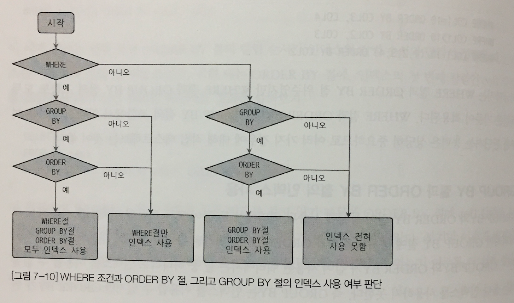

# 들어가며.. 
> ORM 은 DBMS 와의 인터랙션을 블랙박스로 만들어 버리기 때문에 ORM 도구가 DBMS 로 어떤 쿼리를 실행했는지를 알기 어렵다. ORM 이 만들어내는 쿼리가 우리가 작성한 쿼리보다 나은 성능을 보릴 것이라는 기대를 해서는 안되며, 유스케이스별로 ORM이 생성한 쿼리들을 검토해볼 것을 권장한다.
> 
> 즉, ORM 이 최적은 아니어도 최악의 쿼리를 만들어내는 경우를 회피하기 위해 서비스 개발자는 RDBMS 와 쿼리 처리 방싱을 이해할 필요가 있다.

--- 

# 11.쿼리 작성 및 최적화

> SQL 에서 How (어떻게) 를 이해하고, 쿼리를 작성하는 것은 매우 중요하다. 이번 장에서 쿼리의 패턴별로 "어떻게 처리되는가?"에 대해서 살펴본다. 

---

<br>

## 11.1 쿼리 작성과 연관된 시스템 변수

---

### 11.1.1 SQL 모드

<br>

#### (1) STRICT_ALL_TABLES & STRICT_TRANS_TABlELS 

+ INSERT, UPDATE 문장으로 데이터를 변경하는 경우 칼럼의 타입과 저장되는 값의 타입이 다를 때 자동으로 타입 변경을 수행한다. MySQL 서버를 서비스에 적용하기 전에 반드시 활성화 할 것을 권장한다.

#### (2) ANSI_QUOTES

+ 문자열 값을 표헌하기 위해 홑따움표와 쌍다움표를 동시에 사용할 수 있다.

#### (3) ONLY_FULL_GROUP_BY

+ GROUP BY 절에 포함되지 않은 칼럼이라도 집합 함수의 사용없이 그대로 SELECT 나 HAVING 절에 사용할 수 있다.

#### (4) PIPE_AS_CONCAT

+ || 는 OR 연산자와 같은 의미로 사용된다. 하지만 sql_mode 시스템 변수에 PIPE_AS_CONCAT 값을 설정하면 오라클과 같이 문자열 연결 연산자(CONCAT)로 사용할 수 있다.

#### (5) PAD_CHAR_TO_FULL_LENGTH 

+ MySQL 은 CHAR 타입이라고 하더라도 VARCHAR 와 같이 유효 문자열 뒤의 공백 문자는 제거되어 반환된다. 공백을 유지해야 한다면 해당 옵션을 설정한다.

#### (6) NO_BACKSLASH_ESCAPES

+ 역슬래시 문자를 이스케이프 문자로 사용할지 말지를 선택할 수 있다.

#### (7) IGNORE_SPACE

+ 스토어드 프로시저나 함수의 이름 뒤에 공백이 있으면 에러가 출력될 수 있다. 이 옵션을 추가하면 공백을 무시한채 프로시저나 함수를 찾는다.

#### (8) REAL_AS_FLOAT

+ 부동 소수점타입은 FLOAT 과 DOUBLE 타입이 지원되는데, REAL 타입은 DOUBLE 타입의 동의어로 사용된다. 하지만 REAL_AS_FLOAT 모드가 활성화되면 REAL 은 FLOAT 으로 자동 변환된다.

#### (9) NO_ZERO_IN_DATE & NO_ZERO_DATE

+ 두 옵션이 활성화되면 MySQL 서버는 DATE 또는 DATETIME 타입의 칼럼에 잘못된 날짜를 저장하는 것이 불가능해진다.

#### (10) ANSI

+ 앞서 설명한 여러 가지 옵션을 조합해서 MySQL 서버가 최대한 SQL 표준에 맞게 동작하게 만들어준다.

#### (11) TRADITIONAL

+ (1) STRICT_ALL_TABLES & STRICT_TRANS_TABlELS 와 비슷하지만 조금 더 엄격한 방법으로 SQL 의 작동을 제어한다. 해당 모드는 경고로 처리되던 상황을 에러로 바꿀 수 있다.

---

### 11.1.2 영문 대소문자 구분

> MySQL 은 DB 나 테이블이 디스크의 디렉터리나 파일로 매핑되기 떄문에 영문 대소문자를 구분한다. 이는 즉, 윈도우에 설치된 서버에서는 대소문자를 구분하지 않지만 유닉스 계열에서는 대소문자를 구분하게 된다는 의미이다.

+ 설정 파일에 lower_case_table_names 시스템 변수를 설정하면 대소문자 구분을 제어할 수 있다.
+ 이러한 설정 자체를 떠나 대문자 혹은 소문자로 통알해서 사용하는 편이 권장된다.

---

### 11.1.3 예약어

+ 테이블을 생설할 때는 항상 역따옴표로 테이블이나 칼럼의 이름을 둘러싸지 않은 상태로 생설하길 권장한다. 

---

## 11.3 MySQL 연산자와 내장 함수

---

### 11.3.1 리터럴 표기법 문자열 

#### (1) 문자열

+ SQL 표준에서 문자열은 항상 홑따움표를 사용해서 표시하는데 다음과 같이 쌍따움표를 사용해 문자열을 표기할 수 있다.

````SQL
SELECT * FROM tb WHERE tb_no = 'd001';
SELECT * FROM tb WHERE tb_no = "d001";
````

+ 또한 검색할 문자열 값에 홑따움표가 포함된 경우 SQL 표준에선 홑따움표를 두번 입력하지만 MySQL 에서는 쌍따움표와 홑따움표를 이용해 해당 문제를 해결할 수 있다.

````SQL
SELECT * FROM tb WHERE tb_no = 'd''001';
SELECT * FROM tb WHERE tb_no = 'd"001';
SELECT * FROM tb WHERE tb_no = "d'001"; -- mysql만 가능
SELECT * FROM tb WHERE tb_no = "d""001"; -- mysql만 가능
````

#### (2) 숫자

+ 숫자 값을 상수로 SQL에 사용할 때는 따움표 없이 숫자 값을 입력하면 된다. 또한 문자열 형태로 따옴표를 사용하더라도 비교 대상이 숫자 값이거나 숫자 타입의 칼럼이면 문자열을 숫자로 자동 변환한다.

````SQL

1. SELECT * FROM tb WHERE number = '1';  
2. SELECT * FROM tb WHERE string = 1; 
````

+ MySQL 은 숫자 타입과 문자열 타입 간의 비교에서 숫자 타입을 우선시하므로 문자열 값을 숫자로 변환한 후 비교를 수행한다.
+ 첫 번째 쿼리를 자동 타입 변환이 일어나며, 성능과 관련된 문제는 발생하지 않는다.
+ 두 번째 쿼리는 문자열 칼럼을 숫자로 변환해서 비교한다. 즉, 문자열 칼럼의 모든 문자열 값을 숫자로 변환해서 비교 하므로 인덱스를 활용할 수 없다.

#### (4) 날짜
> MySQL 서버는 정해진 형태의 날짜 포맷으로 표기하면 자동으로 DATE 나 DATETIME 값으로 변환하기 때문에 복잡하게 STR_TO_DATE() 같은 함수를 사용하지 않아도 된다.

```SQL
1. SELECT * FROM tb_date WHERE from = '2021-04-29';
2. SELECT * FROM tb_date WHERE from = STR_TO_DATE('2021-04-29', '%Y-%m-%d');
```
+ 첫 번째 쿼리에서 MySQL 서버는 문자열 값을 DATE 타입으로 변환후 비교한다.
+ 두 번째 쿼리는 SQL 에서 문자열을 DATE 타입으로 강제 변환해서 비교하는데 이 두 쿼리의 차이점은 없다. 

#### (5) Boolean
> BOOL 이나 BOOLEAN 이라는 타입이 있지만 사실 이것은 tinyint 타입에 대한 동의어일 뿐이다.

+ MySQL 에서 False 는 C/C++ 언어에서 처럼 정숫값 0이 되지만 TRUE 는 C/C++ 언어와 달리 1만을 의미한다.
+ 불리언 타입보단 ENUM 타입을 권장한다. ENUM 은 조금 더 명확하고 실수할 가능성을 줄이며 확정성도 제공한다.

---

### 11.3.2 MySQL 연산자

#### (1) 동등 (Equal) 비교 (=, <=>)

+ 동등 비교는 "=" 기호를 사용해 비교하면 되고 MySQL 은 "<=>" 비교도 제공하는데 이 연산자는 NULL 값에 대한 비교까지 수행된다. (Null - safe)

```SQL
SELECT 1 = 1, NULL = NULL, 1 = NULL;
>>> 1, NULL, NULL

-- IS NULL 의 또 다른 방법
SELECT 1 <=> 1, NULL <=> NULL, 1 <=> NULL;
>>> 1, 1, 0
```

#### (2) 부정(Not-Equal) 비교 (<>, !=)

+ "같지 않다" 비교를 위한 연산자는 "<>" 와 "!=" 를 사용한다. 어느쪽이든 문제되지 않지만 한가지로 통일하는 방법을 권장한다.

#### (3) NOT 연산자 (!)

+ TRUE 또는 FALSE 연산의 결과를 반대로 (부정) 만드는 연산자로 NOT 또는 "!" 을 사용한다.

#### (4) AND (&&) 와 OR (||) 연산자

+ SQL 의 가독성을 높이기 위해 다른 용도로 사용될 수 있는 "&&" 와 "||" 은 상용을 자제하는 것이 좋다.

#### (5) 나누기 (/, DIV) 와 나머지 (%, MOD) 연산자

+ 나누기는 일반적으로 "/" 를 사용한다. 나눈 몫의 정수 부분만 가져오려면 DIV(절대값 표현) 연산자를 사용한다.
+ 나눈 결과 몫이 아닌 나머지를 가져오는 연산자는 "%", MOD 연산자를 사용한다.

#### (6) REGEXP 연산자

+ 문자열 값이 패턴을 만족하는지 확인하는 연산자이며, RLIKE 는 REGEXP 와 똑같은 비교를 수행한다.
+ RLIKE 를 오른쪽 일치용 LIKE 연산자로 혼동할 때가 있는데 MySQL 의 RLIKE 는 졍규 표현식을 비교하는 연산자이다.
+ 좌측에 비교 대상 문자열 값 또는 문자열 칼럼을 입력하고, 우측에 검증하고자 하는 정규 표현식을 적는다.

```SQL
SELECT 'abc' REGEXP '^[x-z]';
```
+ 정규 표현식은 인덱스 레인지 스캔을 사용할 수 없기에 WHERE 조건절에 해당 연산자를 사용한 조건을 단독으로 사용하는 것은 성능상 좋지 않다.

정규 표현식은 쿼리보단 언어로 짜는게 좋아보이므로 패쓰...

#### (7) LIKE 연산자 

+ 단순한 문자열 패턴 비교 연산자이다.
+ 와일드 카드 문자로 "%" 와 "_" 가 있다. 
  + "%" : 0 또는 1 개 이상의 모든 문자에 일치 
  + "_" : 정확히 1개의 문자에 일치
+ 인덱스를 이용해 처리할 수 있지만 와일드 카드가 검색어 뒤쪽에 위치해야 인덱스 레인지 스캔을 사용할 수 있다. ex) name LIKE 'Moon%';
  + 와일드 카드가 앞쪽에 위치한다면 인덱스 풀 스캔을 탄다. ex) name LIKE '%oon';

#### (8) BETWEEN 연산자

+ "크거나 같다", "작거나 같다" 라는 두 개의 연산자를 하나로 합친 연산자이다. 

```SQL
(dept_no, emp_no) 칼럼으로 구성된 pk 가 존재한다.

1. 
SELECT * FROM dept_emp
WHERE dept_no = 'd003' AND emp_no = 10001;

조건절 모두 인덱스를 이용해 범위를 줄여주는 방법으로 사용할 수 있다.

2.
SELECT * FROM dept_emp
WHERE dept_no BETWEEN 'd003' AND 'd005' AND emp_no = 10001;

BETWEEN 크다 (>) 또는 (<) 작다 연산자와 같이 범위를 읽어야 하는 연산자라서 'd003' 보다 크거나 같고 'd005' 보다 작거나 같은 모든 인덱스의 범위를 검색해야 한다.
결국 BETWEEN 이 사용된 쿼리는 emp_no = 10001 조건은 비교 범위를 줄이는 역할을 하지 못한다.

```

+ BETWEEN 과 IN 은 같지 않다.
 + IN 은 동등 비교 (=) 와 같으며, BETWEEN 은 크다와 작다 비교를 하나로 묶어 둔 것에 가깝다.

```SQL
BETWEEN
d003 ~ d005 까지 모든 레코드 검색 
많은 레코드(10만 건) 를 읽어와서 1 개의 레코드만 리턴한다.

SELECT * FROM dept_emp
WHERE dept_no BETWEEN 'd003' AND 'd005' AND emp_no = 10001; 

최적화

SELECT * FROM dept_emp
WHERE dept_no IN ('d003', 'd004', 'd005') AND emp_no = 10001;

IN
d003:10001, d004:10001, d005:10001 만 검색
```

+ 인덱스 앞 쪽의 선택도가 떨어진다면 IN 으로 바꿔서 성능 최적화를 시키는 방법이 좋다.

#### (9) IN 연산자

+ 여러 개의 값에 대해 동등 비교 연산을 수행한다.
+ IN 연산자는 `상수가 사용된 경우` 와 `서브 쿼리가 사용된 경우` 두 가지 형태가 있다.
  + MySQL 8.0 부터는 `서브 쿼리가 사용된 경우` 의 최적화가 안정화 됐다.
  + IN 절에 튜플(레코드) 를 사용하면 항상 풀테이블 스캔을 했었는데 MySQL 8.0 부터는 튜플 또한 최적으로 사용되도록 개선됐다.
+ NOT IN 연산자는 실행 계획에 인덱스 풀 스캔으로 표시되는데, 이는 동등이 아닌 부정형 비교여서 인덱스를 이용한 처리 범위를 줄이는 조건으로 사용할 수 없기 때문이다.
  + 실행 계획에 인덱스 레인지 스캔이 표시되는 경우가 있지만 pk 가 클러스터링 키이기 때문일 뿐 실제 IN 과 같이 효율적인 실행을 의미하지 않는다.
  
---

### 11.3.3 MySQL 내장 함수

|용도|함수|설명
|:---:|---|---|
| NULL 비교 및 대체 | IFNULL() | 인자가 널이면 대체 문자로 치환후 반환한다.  
| NULL 비교 및 대체 | ISNULL() | 인자가 널인지 비교 후 결과로 TRUE, FALSE 를 반환한다.
| 현재 시각 조회 | NOW() | 하나의 SQL 문장에서 모든 NOW() 함수 값은 동일하다.
| 현재 시각 조회 | SYSDATE() | 함수 호출 시점마다 결과가 달라지며, 복제 서버에서 안정적으로 복제되지 못하고 비교되는 칼럼은 인덱스를 효율적으로 사용하지 못하기에 권장되지 않는다.
| 날짜와 시간 포맷 | DATE_FORMAT(), STR_TO_DATE() | DATETIME 타입의 칼럼이나 값을 원하는 형태의 문자열로 반환해야 할 때 사용한다.
| 날짜와 시간 연산 | DATE_ADD(), DATE_SUB() | 특정 날짜에서 연도나 월일 또는 시간 등을 더하거나 뺄 때 사용된다. 
| 타임스탬프 연산 | UNIX_TIMESTAMP() | '1970-01-01 00:00:00' 으로부터 경과된 초의 수를 반환한다.
| 타임스탬프 연산 | FROM_UNIXTIME() | '1970-01-01 00:00:00' 으로부터 경과된 DATETIME 을 반환한다.
| 문자열 처리 | RPAD(), LPAD() | 좌측 또는 우측에 문자를 덧붙여서 지정된 길이의 문자열로 만드는 함수이다.
| 문자열 처라 | RTRIM(), LTRIM(), TRIM() | RTRIM, LTRIM 은 우측 또는 좌측에 연속된 공백 문자를 제거하는 함수이고 TRIM()은 이 두가지를 동시에 수행하는 함수이다. 
| 문자열 결합 | CONCAT() | 여러개의 문자열을 연결해서 하나의 문자열로 반환하는 함수로, 인자의 개수 제한이 없고 숫자 값을 인자로 전달하면 문자열로 자동 타입 변환 후 연결한다.
| GROUP BY 문자열 결합 | (1) GROUP CONCAT() | COUNT(), MIN(), MAX(), AVG() 등과 같은 그룹 함수 중 하나다. 주로 GROUP BY 와 함께 사용하며, GROUP BY 가 없는 SQL 에서는 단 하나의 결괏값만 만들어낸다. 정렬(ORDER BY)이나 구분자 설정(SEPARATOR)도 가능하며, 중복 제거(DISTINCT) 도 가능하다.
| 값의 비교와 대체 | CASE WHEN THEN END | 프로그래밍에 SWITCH 구문 같은 역할을 한다. 동등 비교 혹은 크거나 작다 비교와 같은 표현식이 사용된다. (조건을 통해 실행 횟수를 줄일 수 있다.)
| 타입의 변환 | CAST(), CONVERT() | SQL 에 포함된 모든 입력값은 문자열처럼 취급된다. 일반적으로 문자열과 숫자, 날짜의 변환은 자동으로 필요한 형태로 변환하는 경우가 많지만 그렇지 않을 때 사용된다.
| 이진값과 16진수 문자열 변환| HEX(), UNHEX() | HEX() 는 이진값을 사람이 읽을 수 있는 형태의 16진수의 문자열로 변환하고 UNHEX() 는 반대로 변환하는 함수이다.
| 암호화 및 해시 함수 | MD5(), SHA(), SHA2() | 암복화 처리를 하기 위한 함수이다.
| 처리 대기 | SLEEP() | 디버깅 용도나 쿼리의 실행 시간을 오랜 시간 유지하고자 할 경우 사용하는 함수이다.
| 벤치마크 | BENCHMARK() | SLEEP() 함수와 같이 디버깅이나 간단한 함수의 성능 테스트용으로 유용한 함수이다. 이 함수의 반환 값은 중요하지 않으며, 단지 지정한 횟수만큼 반복 실행하는데 얼마나 시간이 소요됐는지가 중요하며, 내부 동작으론 이미 할당받은 메모리 자원까지 공유되고 메모리 할당도 1 회전에 대한 할당만 되기 떄문에 생각보다 짧은 시간안에 완료된다. (쿼리 파싱, 최적화, 테이블 잠금, 네트워크 비용 등이 최초에만 생성된다. )
| IP 주소 변환 | INET_ATON(), INET_NTOA() | INET_ATON() 는 Ip 주소를 문자열이 아닌 부호 없는 정수 타입에 저장할 수 있게 제공하며, INET_NTOA() 는 정수형의 Ip 를 사람이 읽을 수 있는 형태로 반환한다.
| JSON 포맷 | JSON_PRETTY() | MySQL 클라이언트에서 JSON 데이터의 기본적인 표시 방법은 단순 텍스트 포맷인데, 이 함수를 사용하면 알기 쉬운 포맷으로 변경해준다. 
| JSON 필드 크기 | JSON_STORAGE_SIZE() | JSON 데이터는 텍스트 기반이지만 서버의 디스크 저장 공간을 절약하기 위해 JSON 데이터를 실제 디스크에 저장할때 BSON 포맷을 사용한다. BSON 으로 변환 됐을 때 저장 공간의 크기를 알기 위해 사용한다.
| JSON 필드 추출 | JSON_EXTRACT() | JSON dom 에서 특정 필드의 값을 가져오는 방법은 여러 가지가 있지만 가장 일반적인 방법은 이 함수를 사용하는 것이다. ex) JSON_EXTRACT(JSON 칼럼명, 가져올 JSON Path) OR JSON 칼럼->$.가져올 JSON Path OR JSON 칼럼->>$.가져올 JSON Path
| JSON 오브젝트 포함 여부 확인 | (2) JSON_CONTAINS() | JSON dom 또는 path 에서 JSON 필드를 포함한지 확인하는 함수이다. 
| JSON 오브젝트 생성 | JSON_OBJECT() | RDBMS 칼럼의 값을 이용해 JSON 오브젝트를 생성하는 함수이다. ex) SELECT JSON_OBJECT("이름", first_name) FROM emp
| JSON 칼럼으로 집계 | JSON_OBJECTAGG() & JSON_ARRAYAGG() | GROUP BY 절과 함께 사용되는 집계 함수로서 RDMS 컬럼들을 모아 JSON 배열 혹은 dom 을 생성하는 함수이다.
| JSON 데이터를 테이블로 변환 | JSON_TABLE() | JSON 데이터의 값들을 모아서 RDBMS 테이블을 만들어 반환한다. 이때 JSON_TABLE() 함수가 만들어서 반환하는 테이블의 레코드 건수는 원본 테이블과 동일한 건수를 가진다. 이 함수는 항상 내부 임시 테이블을 이용하기 때문에 임시 테이블에 레코드가 많이 저장되지 않게 주의가 필요하다.

#### (1) GROUP CONCAT()
> GROUP CONCAT() 함수는 지정한 칼럼의 값들을 연결하기 위해 제한적인 메모리 버퍼 공간을 사용는데 쿼리의 결과가 지정된 버퍼 크기를 넘지 않도록 주의해야 한다.

+ MySQL 8.0 부터는 래터럴 조인이나 윈도우 함수를 이용할 수 있다.
```SQL
윈도우 함수를 이용해 최대 5개 부서만 GROUP_CONCAT 실행

SELECT GROUP_CONCAT(dept_no ORDER BY dept_name DESC) 
FROM (
    SELECT *, RANK() OVER (ORDER BY dept_no) AS rnk
    FROM departments
) as x
WHere rnk <= 5;

래터럴 조인을 이용해 부서별로 10명씩만 GROUP_CONCAT 실행
SELECT d.dept_no, GROUP_CONCAT(de2.emp_no)
FROm departments d 
LEFT JOIN LATERAL ( 
    SELECT de.dept_no, de.emp_no
    FROM dept_emp de 
    WHERE de.dept_no = d.dept_no
    ORDER BY de.emp_no ASC LIMIT 10
) de2 ON de2.dept_no = d.dept_no 

```

#### (2) JSON_CONTAINS()
```SQL
SELECT emp_no FROM employee_docs
WHERE JSON_CONTAINS(doc, '{"first_name" : "승찬"}');

SELECT emp_no FROM employee_docs
WHERE JSON_CONTAINS(doc, '"승찬"', '$.first_name');
```

---

## 11.4 SELECT


### 11.4.1 SELECT 절의 처리 순서

#### 일반적인 SELECT
1. 드라이빙 테이블과 드리븐 테이블들에 대해 WHERE 적용 및 조인 실행
2. GROUP BY
3. DISTINCT
4. HAVING
5. ORDER BY
6. LIMIT

#### GROUP BY절이 없이 ORDER BY만 사용된 쿼리
1. 드라이빙 테이블 읽어서 ORDER BY 적용
2. 드리븐 테이블 WHERE 적용 및 조인 실행
3. LIMIT 적용

--- 
### 11.4.2 WHERE, GROUP BY, ORDER BY 절의 인덱스 사용

#### 11.4.2.1 기본 규칙
- 인덱스 칼럼의 데이터를 가공하지 않아야 한다.
- 가공이 필요하면 우회한다.
  - X : WHERE index * 10 > 1000;
  - O : WHERE index > 1000 / 10;
- 데이터 타입에 맞는 비교조건을 준다.  

#### 11.4.2.2 WHERE 절의 인덱스 사용
- WHERE 조건절의 순서는 인덱스를 사용하는 순서와 무관하다. (옵티마이저의 최적화가 원인)
- 동등 비교 조건이 크다, 작다 조건보다 먼저 실행된다.
- OR 조건이 사용된 경우 비교해야 할 레코드가 더 많아지기 때문에 풀 테이블 스캔을 사용한다.
  - 인덱스를 각각의 칼럼에 맞추어 사용하더라도 index_merge 방식으로 접근돠기 때문에 인덱스 레인지 스캔보다는 느리다. 
  - 인덱스를 효율적으로 이용할 수 있도록 OR 대신 AND로 조건을 주는 것이 좋다.

#### 11.4.2.3 GROUP BY 절의 인덱스 사용
- GROUP BY 절의 명시된 칼럼이 인덱스 칼럼의 순서와 위치기 같아야 한다.
- 인덱스를 구성하는 칼럼 중에서 뒤쪽에 있는 칼럼은 GROUP BY 절에 명시되지 않아도 인덱스를 사용할 수 있지만, 인덱스의 앞쪽에 있는 칼럼이 GROUP BY 절에 명시되지 않으면 사용할 수 없다.
- WHERE 조건절과는 달리 명시된 칼럼이 하나라도 인덱스에 없으면 인떽스를 이용하지 못한다.

#### 11.4.2.4 GROUP BY 절의 인덱스 사용
- GROUP BY 절의 인덱스 사용법과 동일하지만 한가지 조건이 더 있다.
- 정렬되는 칼럼의 오름차순 및 내림차순 옵션이 인덱스와 같거나 정반대인 경우에만 사용할 수 있다.

#### 11.4.2.5 WHERE 조건절과 ORDER BY (또는 GROUP BY) 절의 인덱스 사용
- WHERE 절과 ORDER BY 절이 동시에 같은 인덱스를 사용
  - WHERE, ORDER BY 절의 대상 칼럼이 모두 하나의 인덱스에 연속해서 포함되어 있을 때 사용 가능하다.
  - 성능이 가장 빠르다.
- WHERE 절만 인덱스 이용
  - 인덱스를 통해 검색 후 정렬 처리 과정(Using Filesort) 을 통해 정렬을 수행한다.
  - 주로 WHERE 절의 조건에 일치하는 레코드 건수가 많지 않을 때 효율적인 방식이다.
- ORDER BY 절만 인덱스 이용
  - ORDER BY 절의 순서대로 레코드를 읽으면서 WHERE 절을 하나씩 적용하는 방식이다.
  - 아주 많은 레코드를 조회해서 정렬해야 할 경우 이 방법을 사용하기도 한다.
  
```SQL
인덱스 사용이 가능

WHERE COL_1 > 10 ORDER BY COL_1, COL_2, COL_3; 인덱스 가능

인덱스 사용이 불가능

WHERE COL_1 > 10 ORDER BY COL_2, COL_3; >> WHERE 조건이 동등 비교였다면 가능
WHERE COL_1 = 10 ORDER BY COL_3, COL_4;
WHERE COL_1 > 10 ORDER BY COL_2, COL_3;
WHERE COL_1 IN (1,2,3,4)  ORDER BY COL_2;

```

#### 11.4.2.6 GROUP BY 절과 ORDER BY 절의 인덱스 사용
- GROUP BY 절의 칼럼과 ORDER BY 절의 칼럼이 순서와 내용이 모두 같아야 한다.
- 둘 중 하나라도 인덱스를 이용할 수 없을 때에는 둘다 인덱스를 사용하지 못한다.

#### 11.4.2.7 WHERE, ORDER BY, GROUP BY 절의 인덱스 사용
다음 3개의 질문을 통해 정리할 수 있다.

> 1. WHERE 절이 인덱스를 사용할 수 있는가?
> 2. GROUP BY 절이 인덱스를 사용할 수 있는가?
> 3. GROUP BY와 ORDER BY 절이 동시에 인덱스를 사용할 수 있는가?


출처 : Real Mysql8.0

--- 
